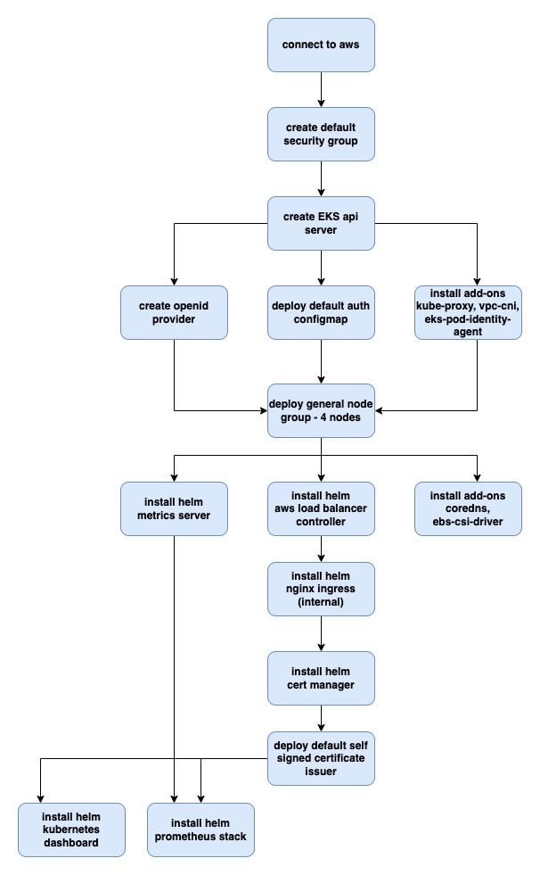

# aws eks terraform



## cli examples
- terraform init
```bash
terraform init
```
- terraform plan
```bash
terraform plan
```
- terrafrom apply
```bash
terrafrom apply --auto-approve
```
- terrafrom destroy
```bash
terrafrom destroy --auto-approve
```
